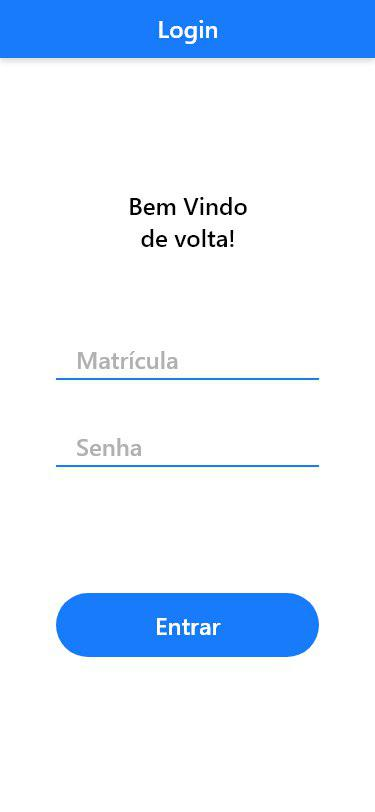

# SIAD -  Sistema Integrado de Agendamento para Departamentos

Professor: Eliane Araujo

Equipe:

- Eduardo Henrique Silva
- Gabriel Almeida
- Gustavo Santos
- João Pedro Barbosa
- Matheus Araújo
- Rafael Azevedo

Content:

- [Contextualizção](##Contextualizção)
    - [A problemática](###A\ problemática)
    - [Impacto](###Impacto)
    - [A proposta de solução](###A\ proposta\ de\ solução)
- [Features](##Features)
    - [Cadastro](###Cadastro)
    - [Login](###Login)
        - [Primeiro Login](####Primeiro\ Login)
        - [Demais Logins](####Demais\ Logins)
    - [Fazer Agendamento](###Fazer\ Agendamento)
    - [Acompanhar Agendamento](###Acompanhar\ Agendamento)
    - [Notificação de Agendamento pelo APP](###Notificação\ de\ Agendamento\ pelo\ APP)
    - [Impacto](###Perfil\ e\ Histórico\ do\ Aluno)
        - [LoAlunogin](####Aluno)
        - [Departamento](####Departamento)  
- [Tecnologias](##Tecnologias)
    - [Spring Boot e PostgreSQL](###Spring\ Boot\ e\ PostgreSQL)
    - [Integração com o Heroku](###Integração\ com\ o\ Heroku)
    - [GitHub](###GitHub)
    - [ReactJS e PWA](###ReactJS\ e\ PWA)
- [Elicitação de Requisitos](##Elicitação\ de\ Requisitos)
    - [Entrevista com os Potenciais Clientes](###Entrevista\ com\ os\ Potenciais\ Clientes)
    - [User Stories (US)](###User\ Stories\ (US))
    - [Requisitos Funcionais](###Requisitos\ Funcionais)
    - [Especificação dos atores da aplicação](###Especificação\ dos\ atores\ da\ aplicação)
    - [Casos de Uso](###Casos\ de\ Uso)
    - [Diagrama de Casos de Uso](###Diagrama\ de\ Casos\ de\ Uso)
    - [Diagrama de Atividades](###Diagrama\ de\ Atividades)

## Contextualizção

### A problemática

 Em uma instituição acadêmica tempo é um recurso bastante valioso. Docentes, discentes e técnicos administrativos possuem calendário e prazos muito apertados para realizar suas atividades. Essa problemática tende a ficar mais caótica durante certas épocas do ano acadêmico, devido a eventos específicos que demandam um esforço extra de todas as partes. 

Um exemplo bastante comum desses eventos são os períodos de matrícula e ajustes de matrículas. De um lado, o coordenador tem que dividir o seu tempo entre resolver problemas relativos às cadeiras que estão sendo ofertadas e atender os alunos que têm problemas relativos às suas respectivas matrículas. Por outro lado, os alunos ficam divididos entre assistir aula e ficar esperando em filas longas na porta de suas coordenações esperando para ser atendido, onde nem mesmo sabe se vai ou não ser atendido.

### Impacto

Docentes e técnicos administrativos que prestam atendimento e alunos que necessitam de atendimento acabam tendo que recorrer a métodos nada dinâmicos e intuitivos para gerenciar e realizar seu agendamentos diários. Essa métodos vão do mais arcaico, como agenda física, ao mais moderno, como bloco de notas ou agendas digitais. Porém o maior problema desses métodos é a necessidade da interação humana para gerenciá-los.

### A proposta de solução

Com um sistema de agendamento os Docentes, discentes e técnicos administrativos terão uma possibilidade de maior controle sobre seus agendamentos de maneira fácil e intuitiva. O sistema de agendamento vai permitir que docentes e técnicos administrativos crie e gerencie departamentos virtuais que poderão prestar atendimentos ao alunos. O sistema vai permitir que os alunos possam fazer agendamento e gerenciá-los.

## Features

Neste tópico será descrito as features que o SIAD será capaz de realizar.

### Cadastro

O cadastro no aplicativo será realizado pelas coordenações e departamentos que farão uso do aplicativo. Essa medida facilitará o uso por parte dos alunos e dará um controle aos departamento sobre quem pode usar o app para fazer o agendamento.

### Login

#### Primeiro Login

O primeiro login na plataforma será feito usando a matrícula como login e o CPF como senha. Ao fazer o login o usuário será redirecionado para o uma tela onde irá cadastrar sua senha pessoal e intransferível.

#### Demais Logins

Após ter sido feito o primeiro login os próximos logins serão feitos usando a matrícula e a senha cadastrada.

### Fazer Agendamento

Para fazer o agendamento, um aluno vai selecionar um dos departamentos que ele que pretende ter atendimento, selecione um horário de atendimento, o motivo e uma breve descrição do motivo. Se ele for elegível para aquele departamento o agendamento será feito.

Um aluno é elegível, se sua matrícula é aceita para o departamento alvo. Por exemplo, não faz sentido um aluno de de Engenharia Elétrica querer atendimento na coordenação de Geografia.

Os horários de agendamentos são disponibilizados e controlados pelos departamentos que farão uso do aplicativo.

### Acompanhar Agendamento

Um aluno poderá acompanhar os agendamentos que fez nos departamentos da Universidade. Ao Abrir um agendamento, poderá visualizar algumas informações adicionais e poderá desmarcar caso, ache necessário.

### Notificação de Agendamento pelo APP

Cerca de 5 minutos antes do atendimento o aluno receberá uma notificação em seu dispositivo avisando-o do atendimento.

### Perfil e Histórico do Aluno

Tanto o aluno como o departamento poderão visualizar seus perfis.

#### Aluno

Um aluno terá acesso a seu perfil que contém informações pessoais e acadêmicas, bem como uma foto de perfil. O mesmo poderá alterar algumas das informações pessoais e académicas contidas. Além disso, poderá ver um histórico dos últimos agendamentos que realizou.

#### Departamento

Um departamento também tem um perfil contendo informações sobre o departamento e <code>(e.g coordenador)</code>. Algumas informações poderão ser alteradas.

Além disso o departamento terá acesso ao perfil e histórico dos alunos que possui agendamentos para no departamentos.

## Tecnologias

A principal prerrogativa para a escolha de algumas tecnologias é que os alunos da graduação interessados, possam contribuir no desenvolvimento e manutenção do projeto. Com isso queremos incentivar ao graduandos a contribuir em projetos open source.

### Spring Boot e PostgreSQL

Spring Boot é uma framework baseada em java para desenvolvimento de backend. Já o PostgreSQL é uma aplicação de gerenciamento de banco de dados SQL.  O principal motivo para a escolha dessas tecnologias é que em algum momento da graduação os alunos se deparam com essas ferramentas sendo utilizadas como suporte nas disciplinas. Além disso, Spring Boot é baseada em java, linguagem que é bastante discutida no curso.

Com isso a escolhas dessas tecnologias facilita a possibilidade de contribuição dos alunos ao projeto.

### Integração com o Heroku

O principal motivo da escolha do Heroku para implantação da aplicação é  sua integração padrão com o PostgreSQL, o que facilita o gerenciamento do banco de dados da aplicação Online.

### GitHub

O GitHub é uma plataforma de controle de versionamento bastante disseminada e utilizada dentro da comunidade, sendo essa uma ótima escolha para a disponibilização e controle do versionamento do projeto.

### ReactJS e PWA

Para o aplicativo cliente foi escolhido o ReactJS para o desenvolvimento de uma aplicação web no conceito de PWA (Progressive Web App), fazendo com que o design se adapte ao dispositivo de acesso e forneça uma experiência agradável ao usuário.

Apesar dessas tecnologias não serem ensinadas ao longo da graduação, elas são bastante utilizadas pelo mercado e é uma ótima opção para aqueles que querem aprender novas tecnologias front end.

## Elicitação de Requisitos

### Entrevista com os Potenciais Clientes

Como parte da modelagem do sistema, a elicitação dos requisitos foi feita a partir de entrevistas realizadas com alguns coordenadores e observando as demandas e queixas dos alunos. Entrevistou-se os coordenadores de Letras e Meteorologia. Para dar dinâmica a entrevista e manter o foco na obejetivo da mesma, a equipe elaborou algumas perguntas rápidas e diretas que foram feitas aos coordenadores.

#### Coordenador de Letras ( Português)

O coordenador relatou algumas queixas relativas ao interação com o controle acadêmico e forma como ele recebe e atende os alunos na coordenação. Durante as conversa fizemos algumas perguntas pertinentes a modelagem.

<b>Pergunta:</b> Quais são as dificuldades enfrentadas com relação ao acesso dos alunos ao coordenador?

<i><b>Resposta:</b> Ele disse que sempre que pode estar disponível e deixa na porta de sua sala um calendário semanal com seus compromissos dentro da universidade para que os alunos possam o procurar e ter acesso. porém relatou que ainda assim muitos alunos têm medo de ir até a coordenação para conversar com ele e isso muitas vezes gera problemas para o aluno a longo prazo.</i>

<b>Pergunta:</b> Existe Alguma época que é mais caótica na coordenação?

<i><b>Resposta:</b> O coordenador relatou que em geral a época, mais caótica é a de ajuste de matrículas, pois, como o controle é muito restritivo com relação às matrículas (citou o exemplo da quantidade mínimas de carga horária), muitos alunos acabam tendo que ir até a coordenação para ter que refazer sua matrícula.</i>

<b>Pergunta:</b> Quais São as funcionalidade que o senhor gostaria de ter em um aplicativo de agendamento?

<i><b>Resposta:</b> Ele disse que gostaria de que pudesse ver de forma clara ou que a ferramenta o alertasse a quantidade alunos que ele vai atender, o horário (relatou em turnos) e quais problemas irá receber para lidar (citou o exemplo de ajuste de matrícula).</i>

#### Coordenador de Meteorologia

<b>Pergunta:</b> Quais são as dificuldades enfrentadas com relação ao acesso dos alunos ao coordenador?

<i><b>Resposta:</b></i>

<b>Pergunta:</b> Existe Alguma época que é mais caótica na coordenação?

<i><b>Resposta:</b></i>

<b>Pergunta:</b> Quais São as funcionalidade que o senhor gostaria de ter em um aplicativo de agendamento?

<i><b>Resposta:</b></i>

### User Stories (US)

ID | US-01
--- | ----
Título | Cadastro de Usuário do Departamento
Motivação | No intuito de utilizar o sistema e gerenciar os agendamentos do seu departamento, o cadastro se faz necessário.
Descrição | O módulo de cadastro é dividido em duas partes: A primeira parte é um formulário simples de cadastro de  informações relativas ao docente ou servidor que vai atender neste departamento. Se o departemento tiver mais de uma pessoa que atende, deve colocar os dados do responsável pelo departamento. As informações são: Nome, Sobrenome, Identificador Único na universidade (e.g SIAPE), email. A segunda parte é um formulário sobre as informações do departamento que está criando. As informações que irá inserir são: Nome do departamento, localização dentro da universidade, Dias de atendimento e horários. Haverá também uma tabela dinâmica com duas colunas ( atendimento/tempo), onde será adicionado os tipos de atendimento e o tempo que leva cada um.

ID | US-02
--- | ----
Título | Cadastro/Login de Usuário Aluno (Primeiro login)
Motivação | No intuito de utilizar o sistema e gerenciar seus agendamentos, o cadastro se faz necessário.
Descrição | O cadastro do aluno deve ser forma simplificada e deve ser pré realizadas pelas entidades superiores da instituição. Para fazer o cadastro/Primeiro login, o aluno insere a matrícula e o CPF para entrar no sistema pela primeira vez e logo em seguida irá criar uma nova senha. Nas demais vezes, o aluno insere apenas matrícula e a senha criada no primeiro acesso.

ID | US-03
--- | ----
Título | Fazer Agendamento (Usuário Aluno)
Motivação | Solucionar um problema com o departamento envolvido no horário conveniente ao aluno e ao responsável.
Descrição | O aluno, de forma simples, irá selecionar o departamento quer atendimento para solucionar seu problema, selecionar o tipo do atendimento, horário de interesse que esteja disponível e uma breve descrição do motivo do atendimento.

ID | US-04
--- | ----
Título | Acompanhar Agendamentos (Usuários Alunos)
Motivação | Gerenciar os agendamentos que o usuário possui em andamento.
Descrição: | O aluno poderá ver, em uma dashboard, todos os agendamentos que fez e ao clicar em um poderá ver os detalhes desse agendamento.

ID | US-05
--- | ----
Título | Visualizar Agendamentos (Usuário Departamento)
Motivação | Gerenciar os agendamentos realizados pelos alunos de modo a descomplicar os problemas enfrentados pelos departamentos.
Descrição: | O Usuário do departamento, poderá visualizar todos os agendamentos que foram realizados pelos aluno em ordem cronológica. Ao selecionar uma agendamento de interesse, observará os detalhes do aluno e agendamento.

ID | US-06
--- | ----
Título | Visualizar Perfil (Usuário Aluno)
Motivação | Facilitar a identificação do aluno para o departamento em questão e permitir ao aluno ter fácil manipulação de dados seus.
Descrição: | O aluno poderá visualizar o seu perfil, que possui suas informações pessoais e académicas. Poderá também, alterar sua foto de perfil,  senha e dados pessoais. Os dados acadêmicos não poderão ser alterados.

ID | US-07
--- | ----
Título | Visualizar Perfil (Usuário Departamento)
Motivação | Gerenciar (visualizar e alterar) os dados referentes ao departamento permitindo que o aluno identifique o departamento de forma simples
Descrição: | O usuário departamento poderá visualizar o seu perfil, que possui suas informações do departamento e do seu responsável.  Poderá também, senha e dados do departamento e docente responsável. É possível também editar tabela de serviços oferecidos.

ID | US-08
--- | ----
Título | Visualizar Histórico (Usuário Aluno)
Motivação | Permitir o aluno visualizar o histórico de seus agendamentos.
Descrição: | O aluno poderá visualizar de maneira simples o histórico de todos agendamento que já passaram cronologicamente.

ID | US-09
--- | ----
Título | Visualizar perfil e histórico do aluno (Usuário Departamento)
Motivação | Dá ao departamento o acesso ao perfil e histórico do aluno que quer prestar atendimento.
Descrição: | O departamento, poderá ter acesso ao perfil, contendo as informações pessoais e acadêmicas de interesse geral, foto do perfil e histórico dos últimos agendamentos realizados pelo aluno.

### Requisitos Funcionais

ID | Descrição | Prioridade
:----: | :----: | :----: 
RF-01 | Register UA     | Essencial
RF-02 | Profile UA      | Essencial
RF-03 | Management UA   | Essencial
RF-04 | Login UC        | Essencial
RF-05 | Profile UC      | Essencial
RF-06 | Scheduling UC   | Essencial
RF-07 | Attendance UC   | Essencial
RF-08 | Notification UC | Essencial
RF-09 | Record UC       | Essencial
RF-10 | Record UA       | Essencial

### Especificação dos atores da aplicação

- **UserAdmin (UA):** Entidade, organização, representação, repartição ou instituição que deseje implantar determinado serviço que seja prestado de forma contínua com a necessidade de se alocar os beneficiados em ordem específica.
- **UserCommom (UC):** Pessoa física ou jurídica que eventualmente estará disposto a usufruir dos serviços prestados pelo UserAdmin.
- **Time (T):** Gradiente de tempo necessário para direcionar o UA em sua alocação de espaço para atendimento e orientar o UC a fim de mostrar os horários disponíveis.

### Casos de Uso

ID | RF-01
---- | ----
Nome | Register UA
Descrição | UserAdmin deverá conseguir se cadastrar na plataforma de forma simples e prática. O cadastro na aplicação deverá ser realizado pelas instâncias superiores dentro da instituição.
Atores | UserAdmin
Prioridade | Essencial
Requisitos Não-Funcionais associados |
Entradas e pré-condições | Clicar no botão de Sign up.
Saídas e pós condições | Usuário cadastrado.
------
- Fluxo de Eventos
    - Fluxo Principal

        1. O usuário clica no botão Sign Up;
        1. O sistema redireciona para a tela de cadastro;
        1. O usuário preenche os seus dados seguindo o modelo exibido;
        1. O usuário concorda com os termos de uso;
        1. O sistema salva os dados do usuário no banco de dados;
        1. O sistema salva os dados de usuário e token no navegador do usuário;
        1. O sistema emite uma mensagem informando que o cadastro foi realizado com sucesso;
        1. O sistema redireciona para a página principal.

    - Fluxo Secundário
        - Caso haja alguma incongruência no item 3, uma mensagem de erro deverá ser emitida em tela;
        - Caso haja divergência no item 4, uma mensagem de advertência deverá ser emitida em tela.
------
ID | RF-02
---- | ----
Nome | Profile UA
Descrição | UserAdmin deverá ter uma sessão de usuário onde esta fornecerá informações sobre o mesmo, além de mostrar requisições feitas  a ele atualmente e anteriormente. O profile deverá conter informações cadastrais, e dados sobre requisições feitas por algum UC em determinado instante de tempo.
Atores | UserCommom, UserAdmin
Prioridade | Essencial
Requisitos Não-Funcionais associados |
Entradas e pré-condições | RF-01
Saídas e pós condições | Perfil gerado e visualizado com sucesso.
------
- Fluxo de Eventos
    - Fluxo Principal

        1. Após a realização do login, o UA deverá ser redirecionado a tela principal do sistema;
        1. Onde esta deverá dispor das opções pertinentes ao sistema, como perfil, atendimento, agendamento e histórico;
        1. O UA deverá escolher dentre uma destas opções ou então sair do sistema;
        1. Escolhendo a opção de perfil, deverá ser mostrado em tela informações sobre o UA.

    - Fluxo Secundário
        - Caso haja alguma incongruência, uma mensagem de erro deverá ser mostrada em tela, e o UA deverá ser redirecionado para a tela principal.
------
ID | RF-03
---- | ----
Nome | Management UA
Descrição | UserAdmin deverá conseguir gerenciar o fluxo de atividade previsto em sua prestação de serviço. O gerenciamento compete no uso de averiguar quantos UC serão atendidos em determinado espaço de tempo.
Atores | UserAdmin, UserCommom, Time
Prioridade | Essencial
Requisitos Não-Funcionais associados |
Entradas e pré-condições | RF-01
Saídas e pós condições |
------
- Fluxo de Eventos
    - Fluxo Principal

        1. O UA entra em seu dashboard;
        1. O UA visualiza sua fila virtual criada;
        1. O UA verifica informações sobre a fila e sobre os usuários que serão beneficiados pelo serviço.

    - Fluxo Secundário
        - Caso haja alguma incongruência, uma mensagem de erro deverá ser emitida em tela.
------
ID | RF-04
---- | ----
Nome | Login UC
Descrição | UserCommom deverá conseguir realizar o login de forma simples e prática na aplicação. O primeiro login deverá ser realizado com sua matrícula e cpf. Logo após o primeiro login, o UC deverá cadastrar uma nova senha para acesso.
Atores | UserCommom
Prioridade | Essencial
Requisitos Não-Funcionais associados |
Entradas e pré-condições |
Saídas e pós condições | Login realizado com sucesso
------
- Fluxo de Eventos
    - Fluxo Principal

        1. O UC entra na aplicação e clica no botão de Sign In;
        1. Logo após aparecerá os campos de user e senha, onde o mesmo deverá preencher com sua matrícula e CPF respectivamente;
        1. Após realizado o primeiro login, o UC será redirecionado para cadastrar uma nova senha para acessos futuros;
        1. Após o Login realizado com sucesso, o usuário é redirecionado para a tela principal.

    - Fluxo Secundário
        - Caso haja alguma incongruência no item 2, uma mensagem de erro deverá ser mostrada em tela e o UC deverá tentar novamente ou sair do sistema.
------
ID | RF-05
---- | ----
Nome | Profile UC
Descrição | UserCommom deverá ter uma sessão de usuário onde esta fornecerá informações sobre o mesmo, além de mostrar requisições feitas anteriormente. O profile deverá conter informações cadastrais, e dados sobre requisições feitas a algum UA em tempo passado.
Atores | UserCommom, UserAdmin
Prioridade | Essencial
Requisitos Não-Funcionais associados |
Entradas e pré-condições | RF-04
Saídas e pós condições | Perfil gerado e visualizado com sucesso.
------
- Fluxo de Eventos
    - Fluxo Principal

        1. Após a realização do login, o UC deverá ser redirecionado a tela principal do sistema;
        1. Onde esta deverá dispor das opções pertinentes ao sistema, como perfil, atendimento, agendamento e histórico;
        1. O UC deverá escolher dentre uma destas opções ou então sair do sistema;
        1. Escolhendo a opção de perfil, deverá ser mostrado em tela informações sobre o UC.

    - Fluxo Secundário
        - Caso haja alguma incongruência, uma mensagem de erro deverá ser mostrada em tela, e o UC deverá ser redirecionado para a tela principal.
------
ID | RF-06
---- | ----
Nome | Scheduling UC
Descrição | O UserCommom deverá conseguir realizar um agendamento de forma simples e prática na aplicação. O agendamento consiste em se dispor a receber um serviço prestado por algum UA em algum T.
Atores | UserAdmin, UserCommom, Time
Prioridade | Essencial
Requisitos Não-Funcionais associados |
Entradas e pré-condições | RF-01; RF-04
Saídas e pós condições | Agendamento realizado com sucesso.
------
- Fluxo de Eventos
    - Fluxo Principal

        1. O UC entra em sua tela principal;
        1. O UC pesquisa por serviço ou UA que esteja ofertando serviço a ser prestado;
        1. O UC seleciona o serviço que deseja;
        1. O UC solicita seu atendimento;
        1. O UC entra na fila de atendimento do serviço a ser prestado.

    - Fluxo Secundário
        - Caso haja alguma incongruência, uma mensagem de erro deverá ser emitida em tela.
------
ID | RF-07
---- | ----
Nome | Attendance UC
Descrição | O UserCommom deverá conseguir realizar o acompanhamento de sua solicitação de forma simples e prática na aplicação. O acompanhamento consiste em verificar o andamento da sua solicitação dentro do fluxo de serviços prestados, assim como sua posição na fila de atendimento.
Atores | UserAdmin, UserCommom
Prioridade | Essencial
Requisitos Não-Funcionais associados |
Entradas e pré-condições | RF-01; RF-04; RF-05
Saídas e pós condições | Acompanhamento verificado com sucesso
------
- Fluxo de Eventos
    - Fluxo Principal

        1. O UC entra na tela principal da aplicação;
        1. O UC seleciona o serviço o qual foi qualificado e que deseja verificar o status;
        1. O UC verifica informações sobre o andamento da sua solicitação assim como sua posição em espera;
        1. O UC retorna à página principal.

    - Fluxo Secundário
        - Caso haja alguma incongruência, uma mensagem de erro deverá ser emitida em tela.
------
ID | RF-08
---- | ----
Nome | Notification UC
Descrição | O UserCommom deverá receber uma notificação de quando estiver próximo de ter sua solicitação atendida. A notificação consiste em uma mensagem de texto mostrada em tela do quão próxima está a vez do UC ser atendido.
Atores | UserAdmin, UserCommom
Prioridade | Essencial
Requisitos Não-Funcionais associados |
Entradas e pré-condições | RF-01; RF-04; RF-05
Saídas e pós condições | Notificação enviada com sucesso
------
- Fluxo de Eventos
    - Fluxo Principal

        1. O UC cadastrado em um serviço prestado por algum UA está próximo de ser atendido;
        1. A aplicação emite uma mensagem de texto que deverá aparecer em tela para o usuário informando o quão próximo este está de ser atendido.

    - Fluxo Secundário
        - Caso haja alguma incongruência, uma mensagem de erro deverá ser emitida em tela.
------
ID | RF-09
---- | ----
Nome | Record UC
Descrição | O UserCommom deverá ter um histórico de atendimento a fim de prestar informarções sobre requisições anteriores realizadas pelo próprio UserCommom para algum UserAdimin em algum Time.
Atores | UserAdmin, UserCommom
Prioridade | Essencial
Requisitos Não-Funcionais associados |
Entradas e pré-condições | RF-01; RF-04; RF-05; RF-07
Saídas e pós condições | Histórico emitido e visualizado com sucesso.
------
- Fluxo de Eventos
    - Fluxo Principal

        1. O UserCommom realiza o login e seleciona a opção histórico na tela principal;
        1. Neste, o UC visualiza informações sobre atendimentos realizados anteriormente.
        1. Em contrapartida, quando um UA recebe uma solicitação de atendimento, o mesmo receberá o histórico do UC;
        1. Este recebimento tem o intuito de orientar o UA a conduzir o atendimento.

    - Fluxo Secundário
        - Caso haja alguma incongruência, uma mensagem de erro deverá ser emitida em tela.
------
ID | RF-10
---- | ----
Nome | Record UA
Descrição | O histórico UA, que por sua vez, visualiza as requisições feitas pelo UserCommom e o orienta em como realizar o atendimento em detrimento dos atendimentos anteriores.
Atores | UserAdmin, UserCommom
Prioridade | Essencial
Requisitos Não-Funcionais associados |
Entradas e pré-condições | RF-01; RF-05; RF-06; RF-07
Saídas e pós condições | Histórico emitido e visualizado com sucesso.
------
- Fluxo de Eventos
    - Fluxo Principal

        1. Em contrapartida, quando um UA recebe uma solicitação de atendimento, o mesmo receberá o histórico do UC;
        1. Este recebimento tem o intuito de orientar o UA a conduzir o atendimento.

    - Fluxo Secundário
        - Caso haja alguma incongruência, uma mensagem de erro deverá ser emitida em tela.
------
### Diagrama de Casos de Uso

Pode-se visualizar abaixo o diagrama de Casos de uso da modelagem do sistema SIAD. O diagrama também encontra-se através deste [link](https://www.lucidchart.com/publicSegments/view/79574687-8144-44c6-b438-6ff1ad6f6235).

### Diagrama de Atividades
